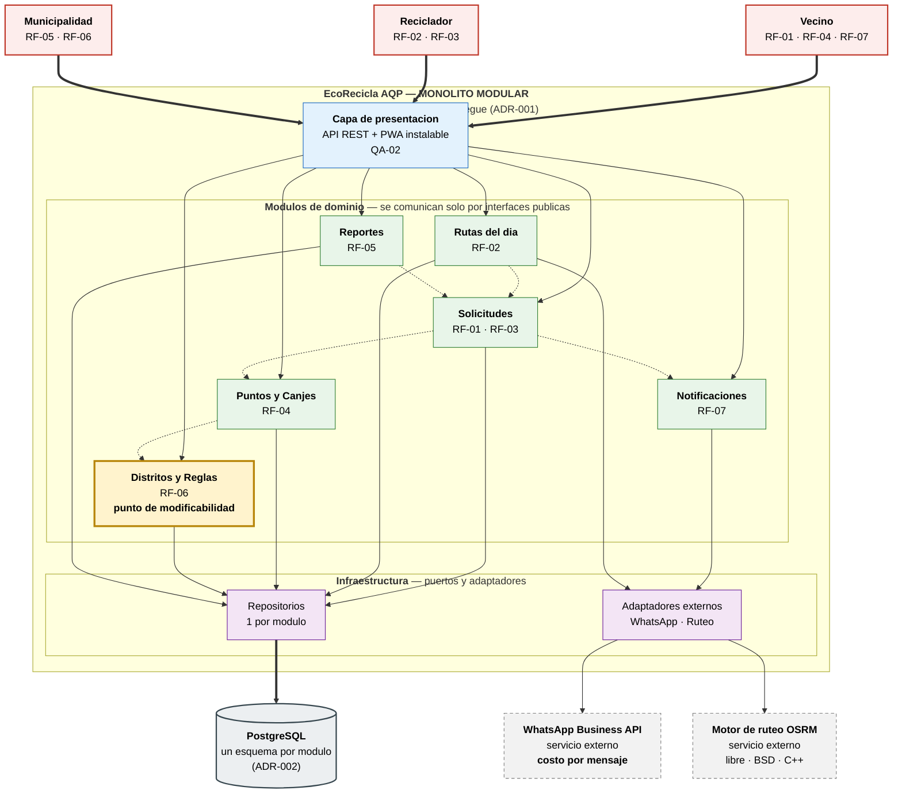

# EcoRecicla AQP — Laboratorio 04: Fundamentos de arquitectura de software

**Construcción de Software** · EPIS-UNSA · 2026-B · **Grupo 04**

> Caso 10 de la guía del Lab 04. Este repositorio documenta la arquitectura de *EcoRecicla AQP* aplicando
> **Diagram as Code** (Mermaid, PlantUML y Python Diagrams) y el uso **crítico** de asistentes de IA.

---

## Integrantes

| # | Nombre | Rol en el laboratorio |
|---|--------|------------------------|
| 1 | **Quenta Ahumada Paulo Estefano** | Diagramador y redactor de decisiones (E3, E5, E6 y los ADR de E4) |
| 2 | **Kevin Joel Callo Ccagiavilca** | Analista de drivers y verificador de IA (E1, E2 y bitácora E7) |

> El reparto de roles es una **propuesta del equipo** para este laboratorio, no una asignación del docente: ambos
> integrantes participan de todo el entregable y se revisan mutuamente.

**Stack del equipo (R-02):** 2 developers. Python / Django como stack principal; tecnologías secundarias en C++,
Java, Node y Angular.

---

## Caso

EcoRecicla AQP es una plataforma para coordinar el **recojo de residuos reciclables con recicladores
formalizados en distritos de Arequipa**. Los vecinos **solicitan el recojo** (RF-01) y **canjean puntos** por
sus aportes (RF-04); los recicladores **consultan su ruta del día** (RF-02) y **confirman el recojo registrando
el peso** (RF-03); la municipalidad **consulta las toneladas recicladas** (RF-05) y **administra distritos y
reglas de puntos** (RF-06). Los avisos al vecino llegan por **WhatsApp** (RF-07).

El **atributo de calidad crítico es la modificabilidad**: incorporar un nuevo distrito o una nueva regla de
puntos debe tomar **≤ 2 días-persona y sin modificar los demás módulos**.

---

## Arquitectura elegida

Se eligió un **monolito modular** en Django (alternativa B, puntaje **4,05**), por encima del monolito en
capas (**3,80**) y de los microservicios (**3,00**).



> Código fuente: [`docs/architecture/diagramas/arquitectura.mmd`](docs/architecture/diagramas/arquitectura.mmd)
> · Imagen: [`img/arquitectura.png`](docs/architecture/diagramas/img/arquitectura.png)

---

## Entregables

| Código | Entregable | Archivo |
|--------|-------------|---------|
| **E1** | Drivers arquitectónicos y escenarios de calidad | [`docs/architecture/drivers.md`](docs/architecture/drivers.md) |
| **E2** | Alternativas con IA y matriz de decisión ponderada | [`docs/architecture/matriz-decision.md`](docs/architecture/matriz-decision.md) |
| **E3** | Diagrama Mermaid de la alternativa elegida | [`docs/architecture/diagramas/arquitectura.mmd`](docs/architecture/diagramas/arquitectura.mmd) |
| **E4** | Tres Architecture Decision Records | [`docs/architecture/adr/`](docs/architecture/adr/) |
| **E5** | Alternativa descartada en PlantUML | [`docs/architecture/diagramas/alternativa.puml`](docs/architecture/diagramas/alternativa.puml) |
| **E6** | Vista de despliegue con Python Diagrams | [`docs/architecture/diagramas/despliegue.py`](docs/architecture/diagramas/despliegue.py) |
| **E7** | Bitácora de uso de IA | [`docs/architecture/bitacora-ia.md`](docs/architecture/bitacora-ia.md) |
| **E8** | Este README y la revisión cruzada | `README.md` |

**Matriz de decisión ponderada** (Figura 4):
[`docs/architecture/diagramas/img/matriz-ponderada.png`](docs/architecture/diagramas/img/matriz-ponderada.png)

**Vista de despliegue** (E6):
[`docs/architecture/diagramas/img/despliegue.png`](docs/architecture/diagramas/img/despliegue.png)

**Alternativa descartada** (E5):
[`docs/architecture/diagramas/img/alternativa.png`](docs/architecture/diagramas/img/alternativa.png)

---

## Decisiones arquitectónicas

- [**ADR-001 — Estilo arquitectónico: monolito modular**](docs/architecture/adr/001-estilo-arquitectonico.md)
- [**ADR-002 — Base de datos: PostgreSQL con un esquema por módulo**](docs/architecture/adr/002-base-de-datos.md)
- [**ADR-003 — PWA en lugar de aplicación nativa**](docs/architecture/adr/003-pwa-vs-app-nativa.md)

---

## Reflexión sobre el uso de la IA (5–8 líneas)

La IA acertó en lo conceptual: los tres estilos son los de la guía, y el riesgo que señaló —que un
monolito modular degenera en capas sin disciplina de límites— terminó siendo la consecuencia negativa del ADR-001.
Sus fallos fueron de omisión, y ninguno se veía leyendo: en la matriz ponderaba "Escalabilidad" sin un driver
detrás: el caso no declara ni un pico de carga. El diagrama Mermaid
parecía correcto y no compilaba, por un comentario vacío; el script de despliegue importaba clases que la librería
no tiene. Los tres fallos aparecieron al ejecutar, no al leer. La lección: **la IA propone y el equipo verifica**,
y verificar significa ejecutar la herramienta.

---

## Cómo regenerar los diagramas

Todos los diagramas son código y se regeneran, no se editan a mano.

```bash
# Requisitos previos del sistema
#   - Graphviz (para los diagramas de Python Diagrams)
#   - Java 8+ y el JAR de PlantUML, descargado de https://plantuml.com/download
#   - Node 18+ (solo para mermaid-cli)
pip install diagrams matplotlib

cd docs/architecture/diagramas

# E3 — diagrama Mermaid
# -s 2 es el factor de escala de Puppeteer: sin él el PNG sale a 735 px de ancho, ilegible
npx -y @mermaid-js/mermaid-cli -i arquitectura.mmd -o img/arquitectura.png -t neutral -b white -s 2

# Figura 4 — matriz ponderada (valida los totales con aserciones antes de graficar)
python matriz-ponderada.py

# E6 — vista de despliegue
python despliegue.py

# E5 — alternativa descartada
# La ruta del JAR es la que se descargó; -o img deja el PNG en img/
java -jar /ruta/a/plantuml.jar -tpng -o img alternativa.puml
```

> Los nombres de salida los decide la herramienta: `alternativa.puml` genera `img/alternativa.png`. Si al
> regenerar el archivo aparece con otro nombre, no lo renombres a mano: corrige el enlace del README, porque un
> PNG con nombre inventado rompe la reproducibilidad justo cuando alguien quiere verificar tu trabajo.

> `matriz-ponderada.py` falla a propósito si los pesos no suman 100 % o si los totales dejan de coincidir con los
> publicados en `matriz-decision.md`. Es una forma barata de garantizar que la matriz no sea una afirmación.

---

## Entrega

- Repositorio: **`cs-2026b-lab04--grupo04`** (público, con el docente como colaborador)
- Fecha límite de entrega: **sábado 03/10/2026, 23:59**, vía Aula Virtual
- Revisión cruzada: cada integrante abre al menos un Pull Request y otro lo revisa y aprueba