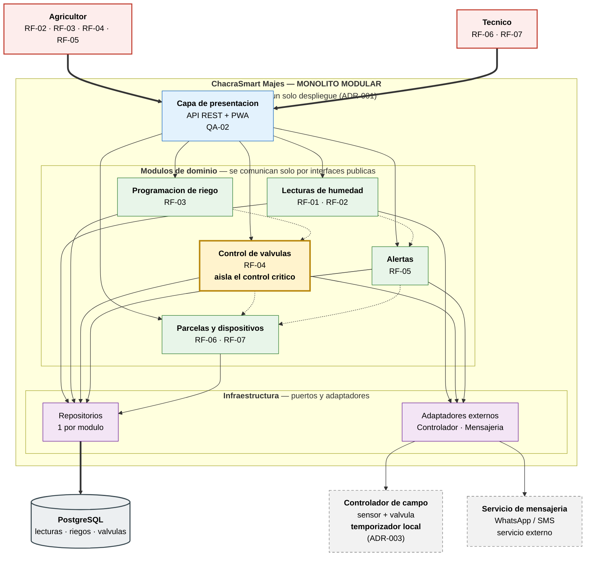
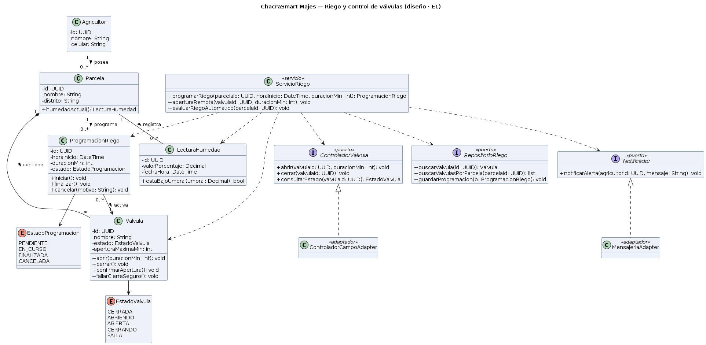
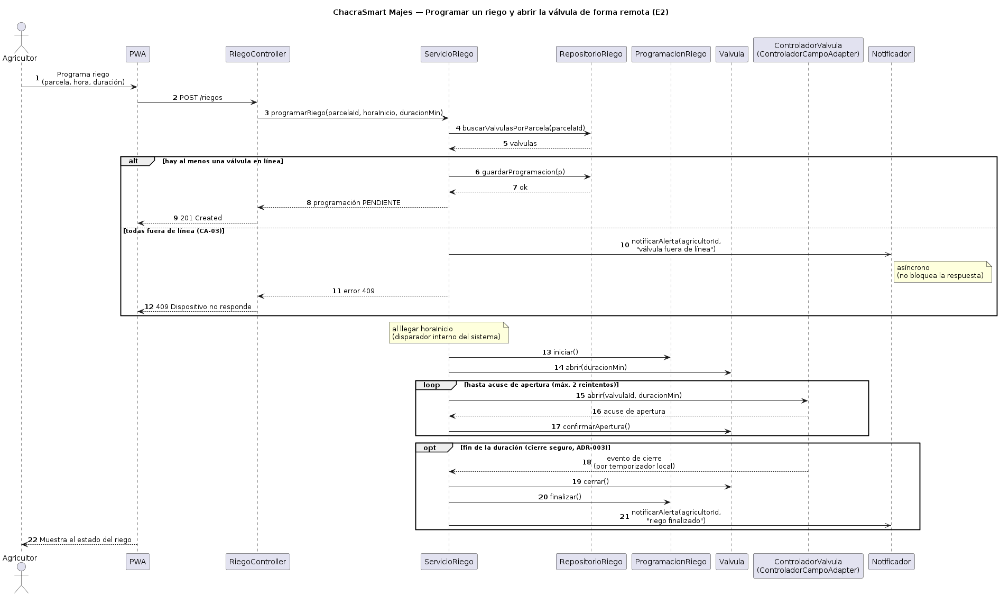
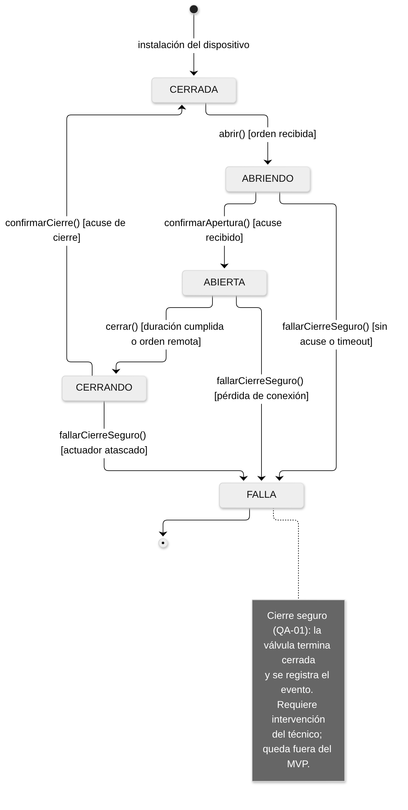
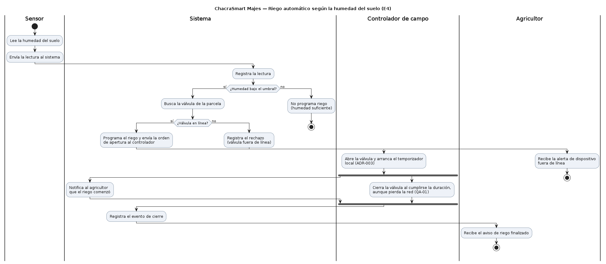
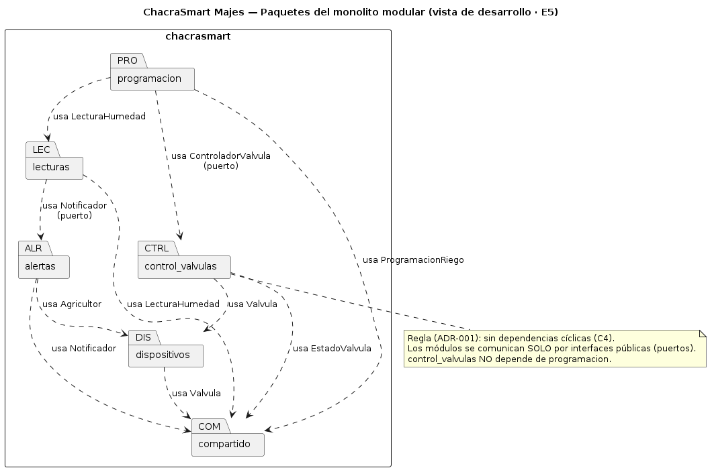
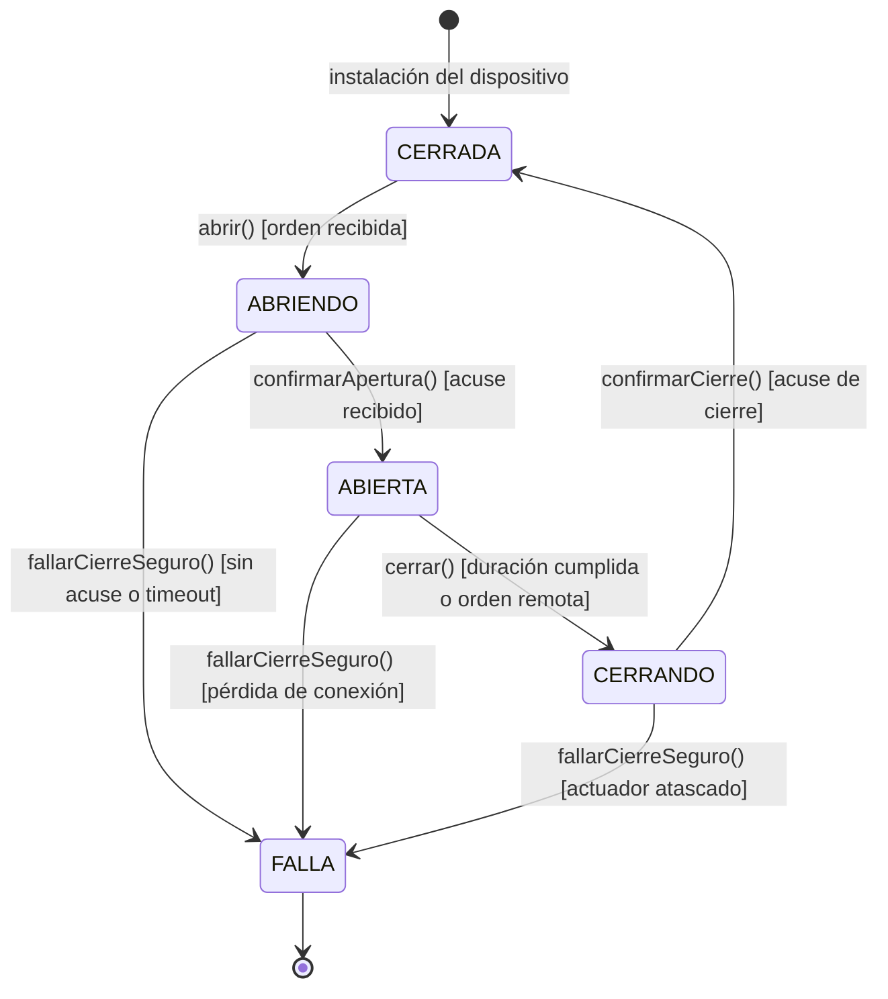

# ChacraSmart Majes — Laboratorio 04: Fundamentos de arquitectura de software

**Construcción de Software** · EPIS-UNSA · 2026-B · **Grupo 04**

> Caso 9 de la guía del Lab 04. Este repositorio documenta la arquitectura de *ChacraSmart Majes* aplicando
> **Diagram as Code** (Mermaid, PlantUML y Python Diagrams) y el uso **crítico** de asistentes de IA.

---

## Integrantes

| # | Nombre | Rol en el laboratorio |
|---|--------|------------------------|
| 1 | **Quenta Ahumada Paulo Estefano** | Diagramador y redactor de decisiones (E3, E5, E6 y los ADR de E4) |
| 2 | **Kevin Joel Callo Ccagiavilca** | Analista de drivers y verificador de IA (E1, E2 y bitácora E7) |

> El reparto de roles es una **propuesta del equipo** para este laboratorio, no una asignación del docente: ambos
> integrantes participan de todo el entregable y se revisan mutuamente.

**Stack del equipo (R-02):** 2 developers. Python / Django como stack principal; tecnologías secundarias en C++,
Java, Node y Angular.

---

## Caso

**ChacraSmart Majes** es una plataforma de **riego inteligente** para parcelas de Majes (Arequipa). Los
**sensores** miden la humedad del suelo y la reportan al sistema (RF-01); el **agricultor** consulta la humedad
actual e histórica de su parcela (RF-02), **programa un riego** indicando parcela, hora y duración (RF-03),
**abre o cierra una válvula de forma remota** (RF-04) y recibe una **alerta por falta de agua** (RF-05); el
**técnico** registra parcelas, sensores y válvulas (RF-06) y consulta si cada dispositivo está en línea o
fuera de línea (RF-07).

El **atributo de calidad crítico es la fiabilidad y protección (safety)**: si se pierde la conexión, **ninguna
válvula debe quedar abierta más del tiempo programado**. De ahí sale la decisión que estructura el resto del
trabajo: la falla segura **no puede depender del servidor**, porque sin conexión no llega ninguna orden. Tiene
que vivir en un **temporizador local del controlador de campo** ([ADR-003](docs/architecture/adr/003-apagado-seguro-en-controlador.md)).

---

## Arquitectura elegida

Se eligió un **monolito modular** en Django (alternativa B, puntaje **4,15**), por encima del monolito en capas
(**4,10**) y de la arquitectura orientada a eventos (**3,05**).

> La ventaja es de apenas **0,05 puntos** sobre A, y conviene decirlo con todas sus letras. La diferencia real
> no está en el número: está en **dónde vive la responsabilidad de cerrar la válvula**. B separa el control de
> válvulas detrás de una interfaz pública; A lo mezcla con el resto de la lógica. Como *Fiabilidad y protección*
> pesa **30 %**, ese aislamiento decide. El análisis completo, con puntajes, está en
> [`matriz-decision.md`](docs/architecture/matriz-decision.md).



> Código fuente: [`docs/architecture/diagramas/arquitectura.mmd`](docs/architecture/diagramas/arquitectura.mmd)
> · Imagen: [`img/arquitectura.png`](docs/architecture/diagramas/img/arquitectura.png)

---

## Entregables

| Código | Entregable | Archivo |
|--------|-------------|---------|
| **E1** | Drivers arquitectónicos y escenarios de calidad | [`docs/architecture/drivers.md`](docs/architecture/drivers.md) |
| **E2** | Alternativas con IA y matriz de decisión ponderada | [`docs/architecture/matriz-decision.md`](docs/architecture/matriz-decision.md) |
| **E3** | Diagrama Mermaid de la alternativa elegida | [`docs/architecture/diagramas/arquitectura.mmd`](docs/architecture/diagramas/arquitectura.mmd) |
| **E4** | Tres Architecture Decision Records | [`docs/architecture/adr/`](docs/architecture/adr/) |
| **E5** | Alternativa descartada en PlantUML | [`docs/architecture/diagramas/alternativa.puml`](docs/architecture/diagramas/alternativa.puml) |
| **E6** | Vista de despliegue con Python Diagrams | [`docs/architecture/diagramas/despliegue.py`](docs/architecture/diagramas/despliegue.py) |
| **E7** | Bitácora de uso de IA | [`docs/architecture/bitacora-ia.md`](docs/architecture/bitacora-ia.md) |
| **E8** | Este README y la revisión cruzada | `README.md` |
| **IV** | Cuestionario oficial resuelto (8 preguntas) | [`docs/cuestionario.md`](docs/cuestionario.md) |
| **Reto** | CI/CD: regeneración automática Mermaid (+2 pts) | [`docs/reto-opcional-ci.md`](docs/reto-opcional-ci.md) |

**Matriz de decisión ponderada** (Figura 4):
[`docs/architecture/diagramas/img/matriz-ponderada.png`](docs/architecture/diagramas/img/matriz-ponderada.png)

**Vista de despliegue** (E6):
[`docs/architecture/diagramas/img/despliegue.png`](docs/architecture/diagramas/img/despliegue.png)

**Alternativa descartada** (E5):
[`docs/architecture/diagramas/img/alternativa.png`](docs/architecture/diagramas/img/alternativa.png)

---

## Diseño UML (Lab 05)

Segundo laboratorio del repositorio: el diseño de los módulos de **programación de riego y control de
válvulas** (caso 9) modelado **como código** — PlantUML y Mermaid — desde la historia de usuario hasta el
esqueleto en Python, con una bitácora de IA de 7 interacciones reales y una auditoría de consistencia que
corrigió una multiplicidad y rechazó dos falsos positivos de la IA.

| Entregable | Fuente | Imagen |
|---|---|---|
| **E1** Diagrama de clases (6+ clases, 3 puertos, 2 enumeraciones) | [`clases.puml`](docs/design/clases.puml) |  |
| **E2** Secuencia "programar un riego y abrir la válvula remota" | [`secuencia-programar-riego.puml`](docs/design/secuencia-programar-riego.puml) |  |
| **E3** Máquina de estados de `Valvula` (Tabla 7) | [`estados-valvula.mmd`](docs/design/estados-valvula.mmd) |  |
| **E4** Actividades "riego automático según la humedad del suelo" | [`actividades-riego-automatico.puml`](docs/design/actividades-riego-automatico.puml) |  |
| **E5** Paquetes por módulo del ADR-001 (sin ciclos, C4) | [`paquetes.puml`](docs/design/paquetes.puml) |  |
| **E6** Ingeniería directa: esqueleto Python + round-trip | [`round-trip.md`](docs/design/round-trip.md) · [`src/valvulas_riego/`](src/valvulas_riego/dominio.py) | — |
| **E7** Historia de usuario y criterios de aceptación | [`historia.md`](docs/design/historia.md) | — |
| **E7** Auditoría de consistencia C1–C5 (1 corrección + 2 falsos positivos) | [`consistencia.md`](docs/design/consistencia.md) | — |
| **E7** Bitácora de IA (7 interacciones con evidencia) | [`bitacora-ia.md`](docs/design/bitacora-ia.md) | — |

El corazón del diseño es la **máquina de estados de la válvula**: materializa la regla *safety* del caso
(QA-01/ADR-003) en el propio modelo — la falla segura es un estado del dominio (`FALLA`), no un comentario:



**Reglas de la Tabla 2 aplicadas (y verificadas):** C1 (mensajes = operaciones), C2 (transiciones =
operaciones), C3 (multiplicidades en ambos extremos), C4 (paquetes sin ciclos) y C5 (nombres consistentes
entre diagramas, código e historias).

```bash
python3 tools/verificar-lab05.py
```

A diferencia de un verificador de keywords, este **implementa la lógica de las reglas**: construye el grafo
dirigido de `paquetes.puml` y detecta ciclos con el algoritmo de Kahn (C4), y comprueba que todo mensaje de la
secuencia y toda transición de estados exista como operación en `clases.puml` (C1/C2).

---

## Decisiones arquitectónicas

- [**ADR-001 — Estilo arquitectónico: monolito modular**](docs/architecture/adr/001-estilo-arquitectonico.md)
- [**ADR-002 — Protocolo de comunicación: HTTP con polling y buffer local**](docs/architecture/adr/002-protocolo-de-comunicacion.md)
- [**ADR-003 — Apagado seguro en el controlador de campo**](docs/architecture/adr/003-apagado-seguro-en-controlador.md)

---

## Reflexión sobre el uso de la IA (5–8 líneas)

El fallo más grave no fue de código: la IA propuso que el servidor cerrara la válvula al detectar la
desconexión, imposible porque sin conexión no llega ninguna orden. Ese error reordenó el atributo crítico y
forzó la decisión que sostiene todo el caso. Los fallos visibles aparecieron al ejecutar: un `NameError` por un
import faltante y tres totales mal calculados que una aserción detectó. El equipo además presentó una
recomendación de hardware como restricción. **La IA propone y el equipo verifica**: un enunciado se verifica
razonándolo, el código ejecutándolo.

---

## Cómo regenerar los diagramas

Todos los diagramas son código y se regeneran, no se editan a mano.

```bash
# Requisitos previos del sistema
#   - Graphviz (para los diagramas de Python Diagrams)
#   - Java 8+ y el JAR de PlantUML, descargado de https://plantuml.com/download
#   - Node 18+ (solo para mermaid-cli)
pip install diagrams matplotlib

cd docs/architecture/diagramas

# E3 — diagrama Mermaid
# -s 2 es el factor de escala de Puppeteer: sin él el PNG sale a 735 px de ancho, ilegible
npx -y @mermaid-js/mermaid-cli -i arquitectura.mmd -o img/arquitectura.png -t neutral -b white -s 2

# Figura 4 — matriz ponderada (valida los totales con aserciones antes de graficar)
python matriz-ponderada.py

# E6 — vista de despliegue
python despliegue.py

# E5 — alternativa descartada
# La ruta del JAR es la que se descargó; -o img deja el PNG en img/
java -jar /ruta/a/plantuml.jar -tpng -o img alternativa.puml
```

> Los nombres de salida los decide la herramienta: `alternativa.puml` genera `img/alternativa.png`. Si al
> regenerar el archivo aparece con otro nombre, no lo renombres a mano: corrige el enlace del README, porque un
> PNG con nombre inventado rompe la reproducibilidad justo cuando alguien quiere verificar tu trabajo.

> `matriz-ponderada.py` falla a propósito si los pesos no suman 100 % o si los totales dejan de coincidir con los
> publicados en `matriz-decision.md`. Es una forma barata de garantizar que la matriz no sea una afirmación.

---

## Verificación automática

El repositorio incluye un verificador que contrasta los entregables contra la rúbrica del Lab 04:

```bash
python3 tools/verificar-rubrica.py
```

No tiene hardcodeados los puntajes, los actores, los módulos ni los nombres de los ADR: **deriva esos datos de
los propios documentos**. Por eso el mismo script sigue sirviendo cuando el equipo cambia de caso, sin
reescribirlo. Sale con código 1 si algún requisito mínimo no está cubierto, lo que lo hace utilizable en
integración continua.

---

## Entrega

- Repositorio: **`cs-2026b-lab04--grupo04`** (público, con el docente como colaborador)
- Fecha de trabajo: **04/10/2026**
- Revisión cruzada: cada integrante abre al menos un Pull Request y otro lo revisa y aprueba